# Deploy Python Machine Learning Apps on AWS EC2

  &nbsp;&nbsp;&nbsp;&nbsp; 


This is a guide to deploying a Python app from a GitHub repository using the Amazon Web Services `EC2` (Elastic Cloud Compute) service, and updates and extends a [2019 YouTube tutorial](https://www.youtube.com/watch?v=jJTa625q85o) (see [Acknowledgements](#acknowledgements) below). It assumes that you already have a working app in development - for example, a `Streamlit` or `Gradio` app - that you are able to launch from your local machine.

The local terminal commands indicated are for a `Git Bash` terminal - I recommend installing `Git Bash` if you haven't already and are on Windows; if you prefer to use another terminal console, note that the command syntax may differ for your operating system.

The `EC2 terminal` commands displayed here are for a Linux-based AMI ("Amazon Machine Image", see below). Amend the commands if using Windows, macOS or another AMI.

Both `Git Bash` and `EC2 terminal` commands are used in this guide - I will indicate which terminal is in use for commands, but you can also read the command prompts as a guide: `EC2 terminal` prompts will begin with `ec2-user`.

## Contents

- [Walkthrough](#walkthrough)
  - [Set up AWS account](#set-up-aws-account)
  - [Launch `EC2` instance](#launch-ec2-instance)
  - [Restrict key pair permissions](#restrict-key-pair-permissions)
  - [Connect to `EC2` via SSH](#connect-to-ec2-via-ssh)
    - [Connect via `.pem` key (option 1)](#connect-via-pem-key-option-1)
    - [Connect via `Host config` (option 2)](#connect-via-host-config-option-2)
  - [Disconnect from `EC2`](#disconnect-from-ec2)
  - [Get Python and Git onto the `EC2` instance](#get-python-and-git-onto-the-ec2-instance)
    - [Set up Python](#set-up-python)
    - [Set up Git](#set-up-git)
  - [Set up SSH key to connect `EC2` with GitHub](#set-up-ssh-key-to-connect-ec2-with-github)
  - [Clone GitHub repo to `EC2`](#clone-github-repo-to-ec2)
  - [Create a virtual environment](#create-a-virtual-environment)
  - [Install and update `pip`](#install-and-update-pip)
  - [Install packages - troubleshooting guide](#install-packages---troubleshooting-guide)
    - [`pip` package installation - standard (option 1)](#pip-package-installation---standard-option-1)
    - [`pip` package installation - TMPDIR (option 2)](#pip-package-installation---tmpdir-option-2)
    - [`pip` package installation - volume size (option 3)](#pip-package-installation---volume-size-option-3)
  - [Add credentials](#add-credentials)
  - [Run the app](#run-the-app)
  - [Deploy the app with `tmux`](#deploy-the-app-with-tmux)
  - [Stop the `tmux` instance](#stop-the-tmux-instance)
- [Appendix: use `S3` to get a machine learning model onto `EC2`](#appendix-use-s3-to-get-a-machine-learning-model-onto-ec2)
  - [Sync `EC2` directory with `S3` bucket (option 1)](#sync-ec2-directory-with-s3-bucket-option-1)
  - [Access `S3` from `EC2` via `boto3` (option 2)](#access-s3-from-ec2-via-boto3-option-2)
- [Acknowledgements](#acknowledgements)

## Walkthrough

### Set up AWS account

1. Setup an [AWS account](https://aws.amazon.com/console/) - it should be possible to get a 12-month subscription to the free tier.

1. Once set up, you will be logged in as the `root user`. For security reasons, do not use the `root user` account to run AWS services - instead, use `IAM` (identity access management) to set up a new user account with admin privileges.

1. Use the search bar in the `AWS Console` navigation menu to go to `IAM`:

   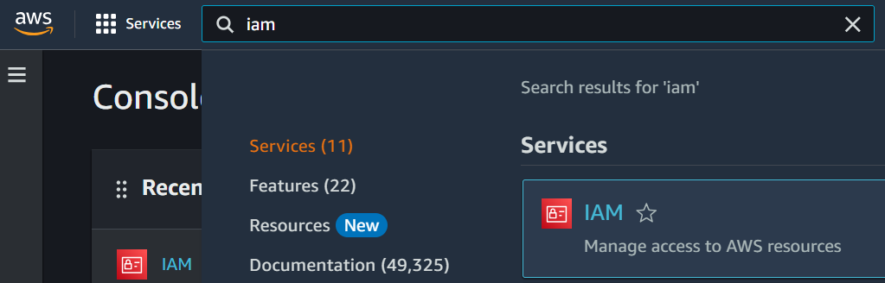

1. From the menu on the left-hand side, select `User groups`, then click `Create group`.

1. Give the group a suitable name, then select the `AdministratorAccess` option.

   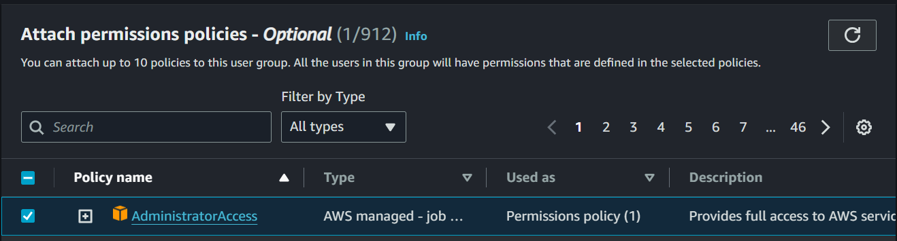

1. Click `Create group`, and the new group will now appear in the list of `User groups`.

   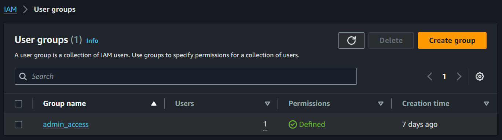

1. From the menu on the left-hand side, select `Users`, then click `Create user`.

1. Give the user a suitable name, then check the boxes for `Provide user access to the AWS Management Console` and `I want to create an IAM user`.

   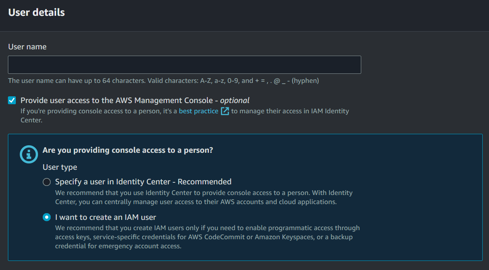

1. Set up the user's password as instructed on-screen, and finish creating the user.

1. Your AWS `user` accounts will share a 12-digit account ID number (XXXX-XXXX-XXXX) in addition to having a unique username and password. You will need each of these credentials to login to the `user` accounts; to access the `root user` account you require only the username and password.

1. Back in `User groups` click on the group just created, then click on `Add users` and select the user just created, then save.

1. Throughout the rest of this guide, the term `AWS Console` refers to the AWS platform accessed through a browser, and specifically to the new `user` with admin privileges created in this section.

1. Log out of the `root user` account, and log into the new `user` account.

### Launch `EC2` instance

1. Use the search bar in the `AWS Console` navigation menu to go to `EC2`:

   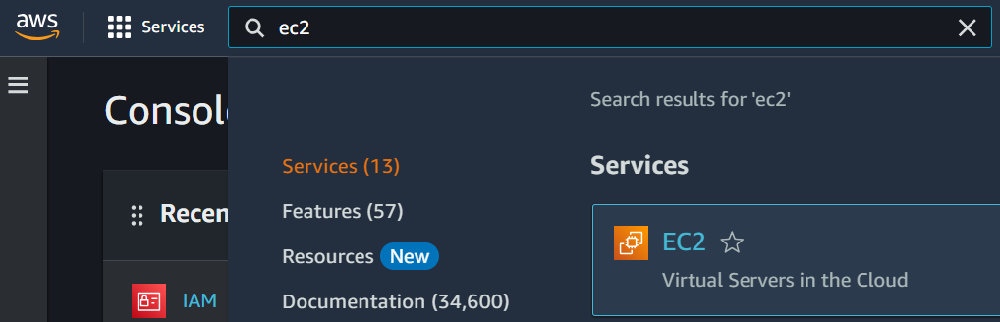

1. Begin to create an `EC2` instance by clicking on "Launch instance":

   

1. Select an AMI (Amazon Machine Image) - this is akin to choosing the operating system for the `EC2` instance. Options include `Amazon Linux`, `macOS`, `Ubuntu`, `Windows` and others. For this demonstration we will select `Amazon Linux`; if you select a non-Linux option, note that the terminal commands may differ from those presented in this guide.

   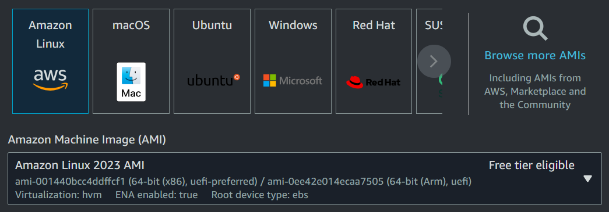

1. Select the instance option - `t2.micro` should be available on the free tier. As of March 2024, `t2.micro` comes with 1 vCPU (virtual CPU) and 1gb of RAM. The price of the instance depends on the OS of the AMI selected - Linux tends to be the cheapest. On the free tier this may be irrelevant, but if your app involves the use of a machine learning model then 1gb of RAM may be insufficent, and you will need to select a paid option.

   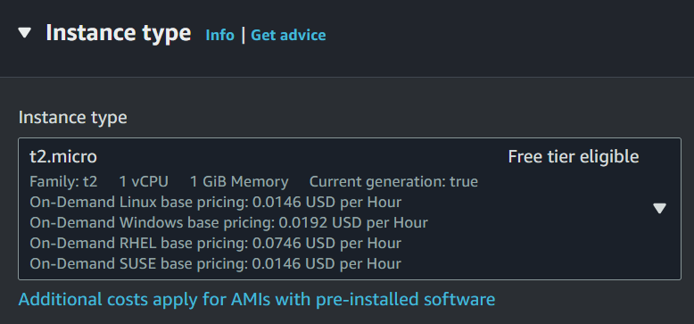

1. Under Network settings, click `Edit`.

   

1. Click `Add security group rule` and apply these settings: `Type=Custom TCP`, `Port range=8501`, `Source=Anywhere`; Streamlit apps run on port `8501` by default - if you're using a different service, check the docs to confirm the correct setting:

   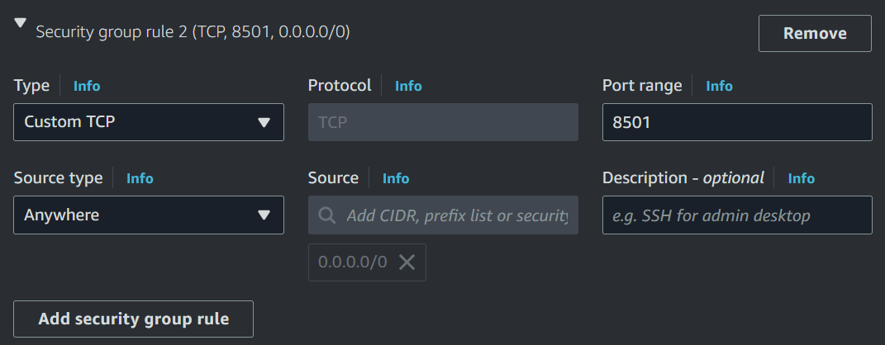

1. Click `Add security group rule` again: `Type=Custom TCP`, `Port range=8502`, `Source=Anywhere`; having two ports provides a backup in case one fails.

1. This should leave you with three security group rules setup: one for the default SSH rule on port `22`, and the two just created on ports `8501` and `8502`.

1. Click `Launch instance`, and you will be prompted to create a `Key Pair`.

   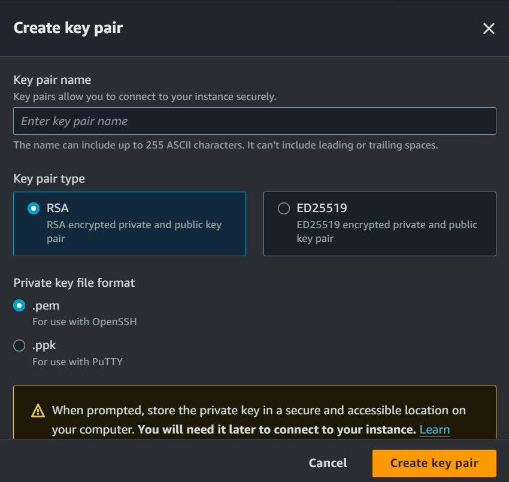

1. Create a new `Key Pair` with the `.pem` extension and a suitable name, then when prompted save it on your local machine for later access.

### Restrict key pair permissions

1. Open `Git Bash` (or another terminal console) in the folder where the `.pem` file is saved on your local machine, and run `ls -lia` to view permissions - there will be e.g. `rw` permissions on the key.

   ```console
   $ ls -lia
   14636XXXX3977862 drwxr-xr-x 1 User 19XX21    0 Mar 13 11:55 demo-app.pem
   ```

1. For security reasons, reduce permissions to read-only - run:

   ```console
   $ chmod 400 {name-of-key.pem}
   ```

1. Re-run `ls -lia` - permissions should now be reduced:

   ```console
   $ ls -lia
   14636XXXX3977862 -r--r--r-- 1 User 19XX21    0 Mar 13 11:55 demo-app.pem
   ```

### Connect to `EC2` via SSH

Once the above steps are done, each time you want to connect to the instance from a local machine you will need to follow one of the two options below. The second option involves slightly more setup, but uses a shorter (and more memorable) command to launch the connection.

Note that each time you launch an `EC2` instance - including a pre-existing one that had been stopped - the public and private IP addresses will change, so these parameters must be updated.

#### Connect via `.pem` key (option 1)

1. Run `ssh -i {name-of-key.pem} ec2-user@{Public IPv4 DNS}` - the `Public IPv4 DNS` parameter is accessible by clicking on the instance in the AWS console:

   ```console
   $ ssh -i {name-of-key.pem} ec2-user@{Public IPv4 DNS}
   ```

1. Enter `yes` when prompted to launch the connection to the instance. An output similar to that below should display - the new prompt message beginning `ec2-user` indicates a successful connection:

   ```console
   $ ssh -i {name-of-key.pem} ec2-user@{Public IPv4 DNS}
   The authenticity of host 'ec2-XX-XXX-XX-XXX.ap-southeast-1.compute.amazonaws.com (XX.XXX.XX.XXX)' can't be established.
   ED25519 key fingerprint is SHA256:XXXXX+wn0yNhs2bS39XXXXXf84ksoPXXXXX0XRb0XXX.
   This host key is known by the following other names/addresses:
       ~/.ssh/known_hosts:4: ec2-XX-XXX-XXX-XXX.ap-southeast-1.compute.amazonaws.com
       ~/.ssh/known_hosts:6: XX.XXX.XXX.XXX
       ~/.ssh/known_hosts:7: XX.XXX.XX.XXX
       ~/.ssh/known_hosts:8: ec2-XX-XXX-XXX-XXX.ap-southeast-1.compute.amazonaws.com
   Are you sure you want to continue connecting (yes/no/[fingerprint])? yes

   A newer release of "Amazon Linux" is available.
     Version 2023.3.20240312:
   Run "/usr/bin/dnf check-release-update" for full release and version update info
      ,     #_
      ~\_  ####_        Amazon Linux 2023
     ~~  \_#####\
     ~~     \###|
     ~~       \#/ ___   https://aws.amazon.com/linux/amazon-linux-2023
      ~~       V~' '->
       ~~~         /
         ~~._.   _/
            _/ _/
          _/m/'
   Last login: Thu Mar 14 01:39:53 2024 from XXX.XXX.XXX.XXX
   [ec2-user@ip-172-XX-XX-242~]$
   ```

   Note that the new terminal prompt `[ec2-user@ip-172-XX-XX-242~]$` includes the numbers from the `Private IPv4 addresses` field of the `EC2` instance on AWS - in this case, `172-XX-XX-242`. These numbers will change each time you start a new instance, or start an existing instance that was dormant.

1. Running "ifconfig" from will show an IP address that matches that of the `EC2` instance (see the third line after `inet`).

   ```console
   [ec2-user@ip-172-XX-XX-242~]$ ifconfig
   enX0: flags=4163<UP,BROADCAST,RUNNING,MULTICAST>  mtu 9001
           inet 172.31.27.242  netmask 255.255.240.0  broadcast 172.31.31.255
           inet6 fe80::c8:82ff:fe83:3d5b  prefixlen 64  scopeid 0x20<link>
           ether 02:c8:82:83:3d:5b  txqueuelen 1000  (Ethernet)
           RX packets 3942  bytes 554004 (541.0 KiB)
           RX errors 0  dropped 0  overruns 0  frame 0
           TX packets 3896  bytes 495018 (483.4 KiB)
           TX errors 0  dropped 0 overruns 0  carrier 0  collisions 0

   lo: flags=73<UP,LOOPBACK,RUNNING>  mtu 65536
           inet 127.0.0.1  netmask 255.0.0.0
           inet6 ::1  prefixlen 128  scopeid 0x10<host>
           loop  txqueuelen 1000  (Local Loopback)
           RX packets 24  bytes 2040 (1.9 KiB)
           RX errors 0  dropped 0  overruns 0  frame 0
           TX packets 24  bytes 2040 (1.9 KiB)
           TX errors 0  dropped 0 overruns 0  carrier 0  collisions 0

   [ec2-user@ip-172-XX-XX-242~]$
   ```

#### Connect via `Host config` (option 2)

1. Open a separate `Git Bash` terminal, then go to the root directory:

   ```console
   $ cd ~
   ```

1. Change from the root directory to the .ssh directory:

   ```console
   $ cd .ssh
   ```

1. View the directory contents using `ls` - if there is a `config` file already, do nothing:

   ```console
   $ ls
   config
   ```

   If there is no `config` file, run `touch config`:

   ```console
   $ ls

   $ touch config
   ```

1. Open the config file using Notepad or another text editor.
1. On a new line, enter details in the following format - choose a suitable name for the `server name`:

   ```
   Host {server name}
       HostName {Public IPv4 address from AWS ECS instance}
       User {ec2-user}
       IdentityFile {location of key pair saved earlier}
   ```

   To get the location for `IdentityFile`, navigate to the directory containing the `.pem` file in `Git Bash`, then run `pwd`. Copy the output of `pwd` and paste it after `IdentityFile`, followed by the name of the .pem file.

   Example:

   ```
   Host demo-app
       HostName 13.215.203.139
       User ec2-user
       IdentityFile /c/Users/{filepath}
   ```

1. Save and close the `config` file.

1. Now, open a new `Git Bash` terminal, and navigate to the root directory:

   ```console
   $ cd ~
   ```

1. Run `ssh {server name}`, replacing `{server name}` with the value entered after `Host` inside the `config` file - in the example provided above, the command to enter would be `demo-app`:

   ```console
   $ ssh {server-name}
   ```

1. If prompted to confirm whether to connect, enter `yes`:

   ```console
   $ ssh {server-name}
   The authenticity of host 'ec2-XX-XXX-XX-XXX.ap-southeast-1.compute.amazonaws.com (XX.XXX.XX.XXX)' can't be established.
   ED25519 key fingerprint is SHA256:XXXXX+wn0yNhs2bS39XXXXXf84ksoPXXXXX0XRb0XXX.
   This host key is known by the following other names/addresses:
       ~/.ssh/known_hosts:4: ec2-XX-XXX-XXX-XXX.ap-southeast-1.compute.amazonaws.com
       ~/.ssh/known_hosts:6: XX.XXX.XXX.XXX
       ~/.ssh/known_hosts:7: XX.XXX.XX.XXX
       ~/.ssh/known_hosts:8: ec2-XX-XXX-XXX-XXX.ap-southeast-1.compute.amazonaws.com
   Are you sure you want to continue connecting (yes/no/[fingerprint])? yes

   A newer release of "Amazon Linux" is available.
     Version 2023.3.20240312:
   Run "/usr/bin/dnf check-release-update" for full release and version update info
      ,     #_
      ~\_  ####_        Amazon Linux 2023
     ~~  \_#####\
     ~~     \###|
     ~~       \#/ ___   https://aws.amazon.com/linux/amazon-linux-2023
      ~~       V~' '->
       ~~~         /
         ~~._.   _/
            _/ _/
          _/m/'
   Last login: Thu Mar 14 02:02:11 2024 from XXX.XXX.XXX.XXX
   [ec2-user@ip-172-XX-XX-242~]$
   ```

### Disconnect from `EC2`

1. If at any time you want to disconnect from the `EC2` terminal, run `exit` to return to `Git Bash`:

   ```console
   [ec2-user@ip-172-XX-XX-242~]$ exit
   logout
   Connection to ec2-XX-XXX-XX-XXX.ap-southeast-1.compute.amazonaws.com closed.
   $
   ```

### Get Python and Git onto the `EC2` instance

#### Set up Python

1. In the `ec2-user` terminal window (after connecting via one of the methods above) run the command `python3` to check for an existing Python installation.

   ```console
   [ec2-user@ip-172-XX-XX-242~]$ python3
   -bash: python: command not found
   ```

1. If Python is not installed, run `sudo yum install python311` to install Python version 3.11, or amend the digits to install a preferred version.

   ```console
   [ec2-user@ip-172-XX-XX-242~]$ sudo yum install python311
   ```

1. Run `python3` to confirm that python has installed successfully.

   ```console
   [ec2-user@ip-172-XX-XX-242~]$ python3
   Python 3.11.6 (main, Nov 22 2023, 00:00:00) [GCC 11.4.1 20230605 (Red Hat 11.4.1-2)] on linux
   Type "help", "copyright", "credits" or "license" for more information.
   >>>
   ```

1. Note that an `EC2` instance may come with a pre-installed version of Python, in which case this would have been visible when you first ran `python3`. If you require a different version of Python, then after installing it via the commands above, you can specify that you want to run e.g. version 3.11 by stating the version name in the command like this:

```console
   [ec2-user@ip-172-XX-XX-242~]$ python3.11
   Python 3.11.6 (main, Nov 22 2023, 00:00:00) [GCC 11.4.1 20230605 (Red Hat 11.4.1-2)] on linux
   Type "help", "copyright", "credits" or "license" for more information.
   >>>
```

#### Set up Git

1. Run `git` to check whether git is installed - if not, run `sudo yum install git` and answer the prompt(s) that follow.

   ```console
   [ec2-user@ip-172-XX-XX-242~]$ git
   -bash: git: command not found
   [ec2-user@ip-172-XX-XX-242~]$ sudo yum install git
   ```

1. Run `git` to confirm that git has installed successfully.

   ```console
   [ec2-user@ip-172-XX-XX-242~]$ git

   usage: git [-v | --version] [-h | --help] [-C <path>] [-c <name>=<value>]
           [--exec-path[=<path>]] [--html-path] [--man-path] [--info-path]
           [-p | --paginate | -P | --no-pager] [--no-replace-objects] [--bare]
           [--git-dir=<path>] [--work-tree=<path>] [--namespace=<name>]
           [--config-env=<name>=<envvar>] <command> [<args>]

   These are common Git commands used in various situations:

   start a working area (see also: git help tutorial)
      clone     Clone a repository into a new directory
      init      Create an empty Git repository or reinitialize an existing one

   ...
   ```

### Set up SSH key to connect `EC2` with GitHub

1. To access the target GitHub repo from `EC2`, set up an SSH key of the `EC2` instance with GitHub.

1. From the `EC2 terminal`, run `ls -a` to view directory contents including hidden files and directories - you should see the folder `.ssh`:

   ```console
   [ec2-user@ip-172-XX-XX-242~]$ ls -a
   .   .bash_history  .bash_profile  .cache  .ssh
   ..  .bash_logout   .bashrc
   ```

1. Change to the `.ssh` directory:

   ```console
   [ec2-user@ip-172-XX-XX-242~]$ cd .ssh
   ```

1. Run this command in the `EC2 terminal` to generate an SSH for connecting the `EC2` instance to GitHub - use the same email address associated with the GitHub account:

   ```console
   [ec2-user@ip-172-XX-XX-242~ssh]$ ssh-keygen -t rsa -b 4096 -C email_address@email_domain.com
   ```

1. Follow subsequent prompts to accept the default save file location for the keys (press `ENTER` at the first prompt) then set up a strong passphrase. If successful, a message will appear ending in the key's randomart image, such as:

   ```console
   The key's randomart image is:
   +---[RSA 4096]----+
   |      .o.+.+..++.|
   |     .  +   ..o..|
   |    +  .     o ..|
   | E + .      . o .|
   |  . .   S .   .o.|
   |       o * . o o=|
   |      o = B o .o=|
   |     . * *   . =o|
   |      o.+ ++o..o+|
   +----[SHA256]-----+
   ```

1. Back in the `.ssh` directory, run `cat id_rsa.pub` to print the public key to the terminal - copy and paste this to a text file.

   ```console
   [ec2-user@ip-172-XX-XX-242~ssh]$ cat id_rsa.pub
   ```

1. Add the new SSH key under GitHub account settings - click on your GitHub profile icon, then click `Settings`. On the next screen, select `SSH and GPG keys` from the menu bar on the left-hand side, then click `New SSH key`.

   

1. Paste the output of the earlier `cat id_rsa.pub` command - this should include the `ssh-rsa` lines at the beginning of the public key and stop after the `==` lines at the end - do not include the email address displayed in the terminal (if applicable). The example below has been truncated - your key will be longer:

   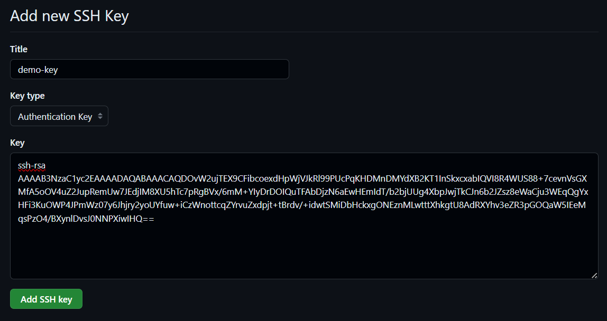

### Clone GitHub repo to `EC2`

1. Still on GitHub, navigate to the target repository and copy the clone link under the SSH tab:

   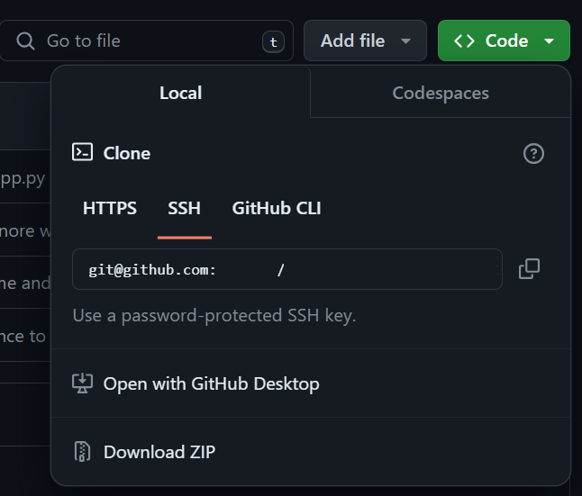

1. In the `EC2 terminal` root directory, run `git clone {clone-link}` and answer the prompts that follow:

   ```console
   [ec2-user@ip-172-XX-XX-242~]$ git clone {clone-link}
   Cloning into '{repo-name}'...
   The authenticity of host 'github.com (XX.XXX.XXX.XXX)' can't be established.
   ED25519 key fingerprint is SHA256:+DiY3wvvXXXXXJhbXXXXX/zLDAXXXXXvHdkrXXXXXqU.
   This key is not known by any other names
   Are you sure you want to continue connecting (yes/no/[fingerprint])? yes
   Warning: Permanently added 'github.com' (ED25519) to the list of known hosts.
   ```

1. Enter the passphrase you chose earlier when creating the SSH key in the `EC2` terminal when prompted, and press enter:

   ```console
   Enter passphrase for key '/home/ec2-user/.ssh/id_rsa':
   remote: Enumerating objects: 312, done.
   remote: Counting objects: 100% (113/113), done.
   remote: Compressing objects: 100% (83/83), done.
   remote: Total 312 (delta 35), reused 52 (delta 30), pack-reused 199
   Receiving objects: 100% (312/312), 455.49 KiB | 470.00 KiB/s, done.
   Resolving deltas: 100% (155/155), done.
   ```

1. Once complete, confirm the clone was successful by running `ls`:

   ```console
   [ec2-user@ip-172-XX-XX-242~]$ ls
   {repo-name}
   ```

### Create a virtual environment

1. Change directory to the cloned repository:

   ```console
   [ec2-user@ip-172-XX-XX-242~]$ cd {repo-name}
   ```

1. Create a venv, specifying the Python version installed earlier (e.g. 3.11):

   ```console
   [ec2-user@ip-172-XX-XX-242~repo-name]$ python3.11 -m venv venv
   ```

1. Activate the venv:

   ```console
   [ec2-user@ip-172-XX-XX-242~repo-name]$ source venv/bin/activate
   (venv)[ec2-user@ip-172-XX-XX-242~repo-name]$
   ```

### Install and update `pip`

1. Install `pip`:

   ```console
   (venv)[ec2-user@ip-172-XX-XX-242~repo-name]$ sudo yum update -y
   (venv)[ec2-user@ip-172-XX-XX-242~repo-name]$ sudo yum install python3 python3-pip -y
   ```

1. Update `pip`:

   ```console
   (venv)[ec2-user@ip-172-XX-XX-242~repo-name]$ python3 -m pip install --upgrade pip
   ```

### Install packages - troubleshooting guide

#### `pip` package installation - standard (option 1)

1. Try this method first.

1. If installing large Python libraries (such as Torch) the install might fail due to device storage space issues - even if the `EC2` instance is mostly empty. If that happens, follow the instructions in the next section.

1. If you need to comment out any dependencies before installing on `EC2`, run `nano requirements.txt` to open the text file in the nano editor inside the console window, then use keyboard arrow keys to go to the relevant dependencies and add `# ` at the start of each line. Once done, enter `CTRL+O` (O for "orange") and press `ENTER` to confirm overwriting the existing `requirements.txt`. Then press `CTRL+X` to exit nano.

1. Install dependencies from `requirements.txt`:

   ```console
   (venv)[ec2-user@ip-172-XX-XX-242~repo-name]$ pip install -r requirements.txt
   ```

   If this fails, try repeating it with the `--no-deps` flag:

   ```console
   (venv)[ec2-user@ip-172-XX-XX-242~repo-name]$ pip install -r requirements.txt --no-deps
   ```

   If this still fails, including if an error message appears stating there is too little storage space on the device, see the next section.

#### `pip` package installation - TMPDIR (option 2)

1. If errors related to disk space appeared during the steps under option 1, the volume the `EC2` instance uses may need to be increased for larger storage space.

1. Before trying to change the volume, first try the following workaround using a temporary directory.

1. Check the current space in the root directory:

   ```console
   (venv)[ec2-user@ip-172-XX-XX-242~repo-name]$ cd ~
   (venv)[ec2-user@ip-172-XX-XX-242~]$ df -h
   Filesystem      Size  Used Avail Use% Mounted on
   devtmpfs        4.0M     0  4.0M   0% /dev
   tmpfs           475M     0  475M   0% /dev/shm
   tmpfs           190M  2.9M  188M   2% /run
   /dev/xvda1       16G   11G  2.5G  23% /
   tmpfs           475M     0  475M   0% /tmp
   /dev/xvda128     10M  1.3M  8.7M  13% /boot/efi
   tmpfs            95M     0   95M   0% /run/user/1000
   ```

   Since this is a newly created instance, the storage space should be mostly empty.

   Even if there is enough space in total, errors may occur when trying to install large libraries to the `EC2` device.

1. To get around the issue of installing large packages, return to the repo directory and try to `pip` install the large libraries into a temporary directory (the below example installs torch):

   ```console
   (venv)[ec2-user@ip-172-XX-XX-242~]$ cd repo-name
   (venv)[ec2-user@ip-172-XX-XX-242~repo-name]$ TMPDIR=/var/tmp pip install torch
   ```

   Do this for each of the large packages in `requirements.txt`.

1. If this is successful, then return to the standard `pip` installation steps outlined above to install the remaining packages - the large packages installed manually just now will not be re-installed.

1. If this is unsuccessful, see the next step regarding volume size.

#### `pip` package installation - volume size (option 3)

1. If both the standard installation method (option 1) and the temporary directory method (option 2) failed try to increase the volume size then repeat option 2.

1. In the `AWS Console` in the browser, navigate to `EC2` then select Instances, and select the `EC2` instance used for this app.

1. Stop the `EC2` instance.

1. On the menu on the left-hand side of the screen (expand the menu if needed), go to `Volumes` and modify the volume for that instance by changing the number. For example, if it was 8 before, replace 8 with 16 for 16gb of storage. The AWS free tier includes around 50gb of total storage space.

1. There will be a delay while the volume is updated. Wait a few minutes until it is complete - click refresh to see the current status.

1. Start the `EC2` instance again - once it is ready it should say something like `2/2 checks passed` under the `Status check` heading of the `EC2` instance.

1. Get the updated `Public IPv4 DNS` value associated with the `EC2` instance, because this resets when an `EC2` instance is stopped and started again.

1. Connect to the `ec2-user` `EC2` instance from your local `Git Bash` terminal again, using either the `.pem` key method or the `Host config` method outlined earlier.

   To reconnect using the `.pem` key method, use the terminal to navigate back to the directory containing the key, and run the following command with the updated `Public IPv4 DNS` address:

   ```console
   $ ssh -i {name-of-key.pem} ec2-user@{Public IPv4 DNS}
   ```

   To reconnect using the `Host config` method, update the `config` file created earlier with the updated `Public IPv4 DNS` address, then return to the root directory and run:

   ```console
   $ ssh {server-name}
   ```

1. Now that the `EC2` instance volume size has been increased, and you have reconnected to the `ec2-user` instance, repeat the steps under option 2 to install the packages.

### Add credentials

1. If your app makes use of credentials such as API keys, add them to the repo on the `EC2` instance.

1. If at all possible, use a different set of credentials to those used in development on the local machine - obtain separate API keys, for example.

1. If using `dotenv` to handle credentials on a local machine, you can create a matching `.env` file in the repo directory using the nano text editor:

   ```console
   (venv)[ec2-user@ip-172-XX-XX-242~repo-name]$ nano .env
   ```

1. This should open the `.env` file in nano within the `EC2` console.

1. Paste the relevant credentials from your local `.env` file into the `EC2` `.env` file.

1. Press `CTRL+O` (O for "orange") and press `ENTER` to save the changes.

1. Press `CTRL+X` to exit nano.

1. Run `ls -a` to confirm the `.env` file now appears in the repo:

   ```console
   (venv)[ec2-user@ip-172-XX-XX-242~repo-name]$ ls -a
   .  ..  .env  .git  .gitignore  LICENSE  README.md  requirements.txt  src  venv
   ```

### Run the app

1. With the installation complete, the app can now be run from the `EC2` instance as on a local machine.

1. For instance, for a Streamlit app, activate the venv (`source venv/bin/activate`) and navigate to the `src` (or other) directory and run:

   ```console
   (venv)[ec2-user@ip-172-XX-XX-242~repo-name]$ streamlit run app.py
   ```

   The app should launch in a browser window.

### Deploy the app with `tmux`

1. To deploy the app, it needs to keep running in the background - not just when we run it locally in the terminal.

1. To get the app to keep running when you exit the `EC2 terminal`, use `tmux`:

   ```console
   (venv)[ec2-user@ip-172-XX-XX-242~repo-name]$ sudo yum install tmux

   ...

   Installed:
     tmux-3.2a-3.amzn2023.0.2.x86_64

   Complete!
   (venv)[ec2-user@ip-172-XX-XX-242~repo-name]$
   ```

1. With `tmux` installed, create a `tmux` instance for the app:

   ```console
   (venv)[ec2-user@ip-172-XX-XX-242~repo-name]$ tmux new -s demo_instance
   ```

1. A `tmux` terminal session will open:

   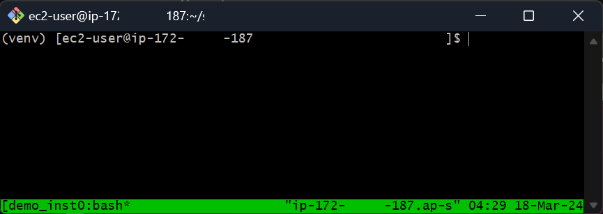

1. Change to the `src` directory where your `app.py` (or equivalent) file is, and run the app:

   ```console
   (venv)[ec2-user@ip-172-XX-XX-242~repo-name]$ cd src
   (venv)[ec2-user@ip-172-XX-XX-242~src]$ streamlit run app.py

   Collecting usage statistics. To deactivate, set browser.gatherUsageStats to False.

   You can now view your Streamlit app in your browser.

   Network URL: http://172.XX.XX.242:8501
   External URL: http://13.XXX.XX.134:8501
   ```

1. Confirm the app is running correctly, then close it down with `CTRL+C`:

   ```console
   ^C  Stopping...
   (venv)[ec2-user@ip-172-XX-XX-242~src]$
   ```

1. Attach a session to the `tmux` instance, then re-run the app:

   ```console
   (venv)[ec2-user@ip-172-XX-XX-242~src]$ tmux attach-session -t demo_instance
   sessions should be nested with care, unset $TMUX to force
   (venv)[ec2-user@ip-172-XX-XX-242~src]$ streamlit run app.py
   ```

1. Once the app is confirmed to be running, you can detach from the `tmux` instance to exit the `tmux` terminal while keeping the app running by typing `CTRL+B` then `d` - you should exit to the `EC2` terminal.

   ```console
   [detached (from session demo_instance)]
   (venv)[ec2-user@ip-172-XX-XX-242~repo-name]$
   ```

1. Check your app - it should still be running!

### Stop the `tmux` instance

1. If you want to stop the `tmux` instance (or `window`) from running, then enter the `tmux` command from the `EC2` terminal to return to the `tmux` terminal:

   ```console
   (venv)[ec2-user@ip-172-XX-XX-242~repo-name]$ tmux
   ```

1. Run `tmux ls` to view a list of `tmux` instances - in the below example the `demo_instance` window is visible:

   ```console
   (venv)[ec2-user@ip-172-XX-XX-242~repo-name]$ tmux ls
   1: 1 windows (created Mon Mar 18 05:00:11 2024) (attached)
   demo_instance: 1 windows (created Mon Mar 18 04:28:47 2024)
   (venv)[ec2-user@ip-172-XX-XX-242~repo-name]$
   ```

1. Run `tmux kill-session -t {instance_name}`, replacing `{instance_name}` with the name given to the instance during creation - in this case, `demo_instance`:

   ```console
   (venv)[ec2-user@ip-172-XX-XX-242~repo-name]$ tmux kill-session -t demo_instance
   (venv)[ec2-user@ip-172-XX-XX-242~repo-name]$
   ```

1. Re-running `tmux ls` should reveal that the target instance is no longer there:

   ```console
   (venv)[ec2-user@ip-172-XX-XX-242~repo-name]$ tmux ls
   1: 1 windows (created Mon Mar 18 05:09:57 2024) (attached)
   (venv)[ec2-user@ip-172-XX-XX-242~repo-name]$
   ```

1. You can confirm that the app is no longer running by refreshing it in your browser.

1. Enter `CTRL+B` then `d` to return to the `EC2` terminal.

1. If you want to re-deploy the app at a later time, simply redo the steps under [Deploy the app with `tmux`](#deploy-the-app-with-tmux).

## Appendix: use `S3` to get a machine learning model onto `EC2`

Machine learning models are often large and therefore unsuitable for storing on a GitHub repo - in which case, the model will not have been cloned along with the repo, and we need another way to give our app access to the model from `EC2`.

`Amazon S3` (Simple Storage Service) is an unstructured cloud storage service built into AWS. It integrates with other AWS services, so that data stored on an `S3` "bucket" can be used elsewhere.

I will outline two ways to take advantage of `S3` to integrate a model with an `EC2` instance.

First, follow these steps to create and set up an `S3` bucket.

1. Use the search bar in the `AWS Console` navigation menu to go to `S3`:

   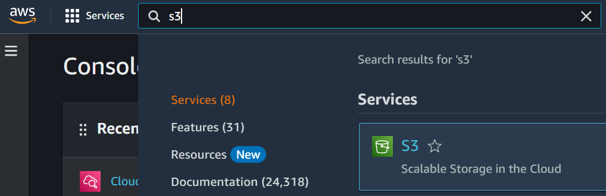

1. Select `Buckets` from the menu on the left-hand side of the screen, then click `Create bucket`:

   

1. Give the `S3` bucket a suitable name, and select the region to locate the bucket in (hint: select your nearest region and the same region the `EC2` instance exists in):

   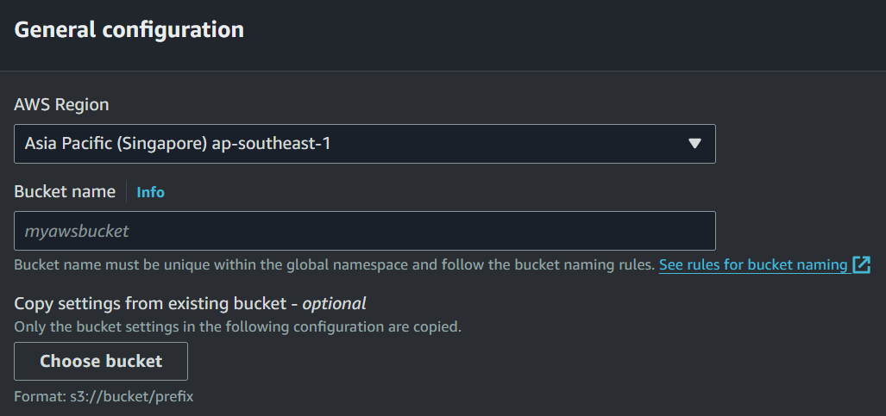

1. Use the default security settings on the rest of the page, unless you have a specific need to change them. By default, the `S3` bucket will not be publicly accessible - this is appropriate, because the `EC2` instance will access `S3` internally.

1. Once created, select the link for the newly created `S3` in the `Buckets` page, then click `Upload` to select the files or folders to be uploaded.

   

1. Note the name of the `S3` bucket you saved the model to (e.g. `spacy-model-bucket`), the region of the bucket (e.g., Singapore region `ap-southeast-1`), and the name of the model folder or file you saved on the bucket (e.g., `spacy-model`).

1. Use the search bar in the `AWS Console` navigation menu to go to `IAM`:

   

1. Select `Roles` from the menu on the left-hand side, then click `Create role`.

   

1. Keep the default `AWS Service` option under the `Trusted entity type` selection, then in the `Service or use case` dropdown menu under `Use case`, choose `EC2` and click `Next`.

1. On the `Add permissions` screen that follows, search for `AmazonS3` and select the `AmazonS3ReadOnlyAccess` option, then click `Next`:

   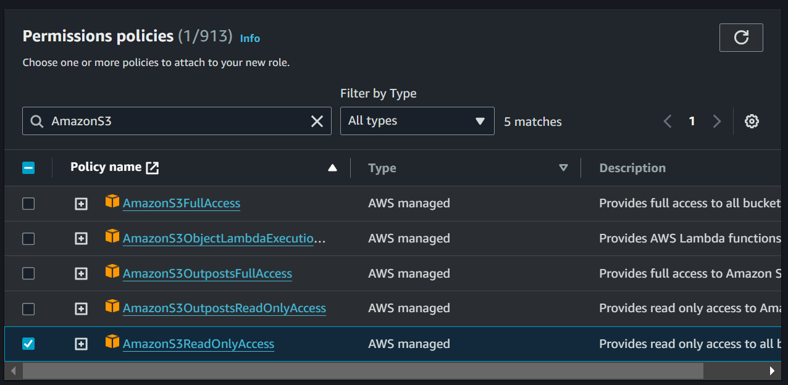

1. On the `Name, review, and create` screen that follows, give the role a suitable name and add a description (e.g., "Allows `EC2` instances to access `S3` services.").

1. Keep the remaining default settings and click `Create role`.

1. Use the search bar in the `AWS Console` navigation menu to go to `EC2`.

   

1. Select the `EC2` instance for the app.

1. Select `Actions/Security/Modify IAM role`

   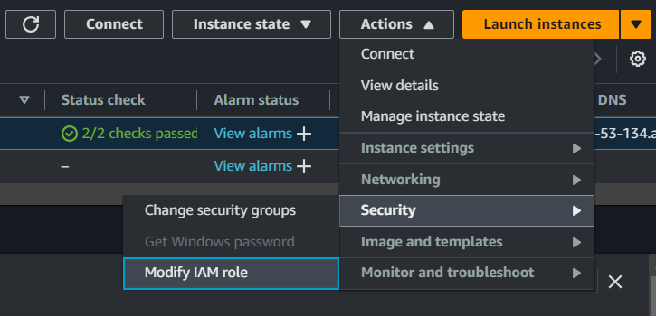

1. In the screen that opens, select the `IAM` role you created and click `Update IAM role`:

   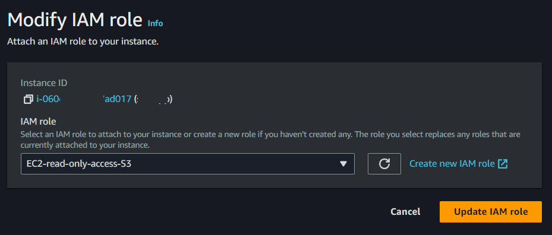

1. Back under the `EC2` instance details, you should see the name of the `IAM` role displayed under the `Security` tab (in this example, a role named `EC2-read-only-access-S3`):

   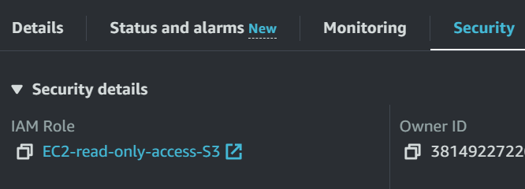

### Sync `EC2` directory with `S3` bucket (option 1)

The advantage of this first method is its simplicity: by syncing the model from `S3` onto the `EC2` instance, the same structure can be used as on the local machine, and it is not necessary to amend the code of the app to reference a different path to the model.

The below example assumes that the repo's `src` directory contains a sub-directory `models` into which the model should be synced.

1. Inside `src`, create the target directory into which the model should be synced - in this case, a folder named `models`:

   ```console
   [ec2-user@ip-172-XX-XX-242~src]$ mkdir models
   ```

1. Change to the new directory, and get the path:

   ```console
   [ec2-user@ip-172-XX-XX-242~src]$ cd models
   [ec2-user@ip-172-XX-XX-242~models]$ pwd
   /home/ec2-user/repo-name/src/models
   ```

1. Sync the contents of the `S3` bucket onto `EC2` by running `aws s3 sync s3://{bucket_name}/{model_name} {target/directory/path}`, such as in the below example:

   ```console
   [ec2-user@ip-172-XX-XX-242~models]$ aws s3 sync s3://spacy-model-bucket/spacy-model /home/ec2-user/repo-name/src/models
   download: s3://spacy-model-bucket/spacy-model/transformer/cfg to transformer/cfg
   download: s3://spacy-model-bucket/spacy-model/config.cfg to ./config.cfg
   download: s3://spacy-model-bucket/spacy-model/textcat/cfg to textcat/cfg
   download: s3://spacy-model-bucket/spacy-model/vocab/lookups.bin to vocab/lookups.bin
   download: s3://spacy-model-bucket/spacy-model/vocab/vectors to vocab/vectors
   download: s3://spacy-model-bucket/spacy-model/vocab/vectors.cfg to vocab/vectors.cfg
   download: s3://spacy-model-bucket/spacy-model/meta.json to ./meta.json
   download: s3://spacy-model-bucket/spacy-model/tokenizer to ./tokenizer
   download: s3://spacy-model-bucket/spacy-model/vocab/strings.json to vocab/strings.json
   download: s3://spacy-model-bucket/spacy-model/vocab/key2row to vocab/key2row
   download: s3://spacy-model-bucket/spacy-model/textcat/model to textcat/model
   download: s3://spacy-model-bucket/spacy-model/transformer/model to transformer/model
   ```

1. Confirm the model has synced across:

   ```console
   [ec2-user@ip-172-XX-XX-242~models]$ ls
   spacy-model
   ```

### Access `S3` from `EC2` via `boto3` (option 2)

This option involves connecting `EC2` to an `S3` bucket at runtime. An advantage of this method is that the model need not use up space on the `EC2` instance; a disadvantage is that some code amendments are required to faciliate the connection, using the `boto3` library.

1. The `boto3` Python library is used to interact with `S3` - install it in the repo's venv:

   ```console
   (venv)[ec2-user@ip-172-XX-XX-242~repo-name]$ pip install boto3
   ```

1. With `boto3` installed, the below code shows an example of how to update the `app.py` file of a Streamlit app to be able to access a spaCy machine learning model stored on `S3`.

   ```python
   # app.py
   # ...other imports
   import boto3

   # Download spaCy model from "S3" bucket
   "s3" = boto3.client("s3", region_name="ap-southeast-1")
   # Name of "S3" bucket
   bucket_name = "spacy-model-bucket"
   # Name of model directory or file inside "S3" bucket
   model_key = "spacy-model"
   # Set a temporary location for the model to download to on the EC2 instance
   tmp_path = "/tmp/downloaded_model"
   # Download the model from "S3" to the temporary location
   s3.download_file(bucket_name, model_key, tmp_path)
   ```

1. Elsewhere in your code, replace references to the model's path on your local machine with the path of the model downloaded from `S3` to the `EC2` instance - for example, in the case of this spaCy model:

   ```python
   # app.py
   # ...other imports
   import boto3

   # ...other code

   nlp = spacy.load(tmp_path)
   ```

## Acknowledgements

The core of this guide is based on Jesse Agbe's excellent YouTube tutorial [How To Deploy Streamlit Apps on AWS Ec2](https://www.youtube.com/watch?v=jJTa625q85o), from his channel [JCharisTech](https://www.youtube.com/@JCharisTech).

The AWS platform has changed since that video's October 2019 release; this guide provides updated instructions as of March 2024, introduces details on how to handle `EC2` memory issues that might arise, and describes how to access a machine learning model (or other data) stored in an `S3` bucket.
